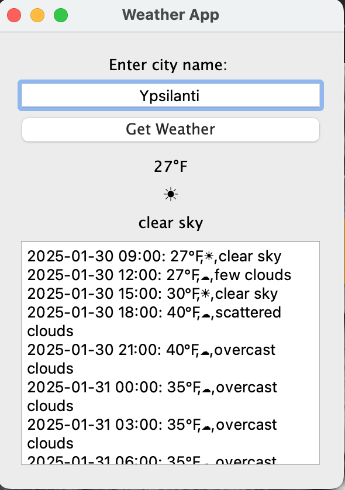

# final-project-LongNguyenThanhLe

## Getting Started
### Clone the repository and CD into the directory
```bash
git clone https://github.com/COSC381-2024Fall/final-project-LongNguyenThanhLe
cd final-project-LongNguyenThanhLe
```
### Set up the virtual environment
```bash
python3 -m venv .venv
source .venv/bin/activate
pip3 install -r requirements.txt
```

> `.venv` is in `.gitignore`. Please try to use `.venv` for the virtual environment name. Do **NOT** commit the virtual environment to the repository.

At this point you should be good to go. You can run the program while sourced inside of the virtual environment. To exit the virtual environment, simply type `deactivate`. Make sure your IDE is set up to use the virtual environment as well. Visual Studio Code should automatically detect the virtual environment and use it.

### API Key Setup: Instructions for adding an API key via a .env file.
To get an OpenWeatherMap API key, you can:
Go to the https://openweathermap.org/
You can find your API keys in your account dashboard by:
1. Signing in to your OpenWeather account
2. Going to your account name in the top-right corner
3. Clicking on "My API" in the drop-down menu
   
### Usage Guide: How to interact with the application.

To run program, first you need to paste your api key to the class main.py, line 6
Then you can click to terminal and type in "python3 main.py"

### Running Tests
1. Install pytest:
```bash
pip install pytest
```
2. Run the tests:
```bash
pytest
```

